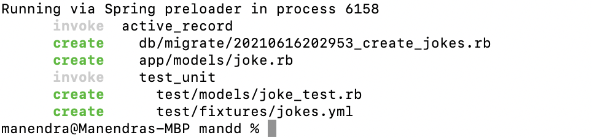

# Understanding Models and Databases - Rails


### What is a database ?

A database is a software program that we use to store our data in an organised manner.

### Why do we use databases ?

We use databases to both ' Store ' and ' Access ' data . in context with Rails - Store can be seen as ' Create ' and Access can be broken down further into ' Read ' , ' Delete ' and ' Update '

### What are the databases supported by Rails ?

The following databases are supported in a Rails environment

- SQLite
- MySQL
- PostgreSQL
- DB2
- Firebird 
- FrontBase
- OpenBase
- Oracle
- Microsoft SQL Server
- Sybase

### What is a Model and where does it fit into all of this ?

Not too long ago programs connected to databases directly, and queried (extracted a defined set of data) data using SQL . SQL  stands for ' structured query language ' and is the standard language used to communicate with Relational databases. This is a very low level implementation where we might have to write many lines of SQL code just to extract a few rows of data. (observe the php code below)

```php
$conn = new mysqli($servername, $username, $password, $dbname);
// Check connection
if ($conn->connect_error) {
  die("Connection failed: " . $conn->connect_error);
} 

$sql = "SELECT * FROM Users";
$result = $conn->query($sql);

if ($result->num_rows > 0) {
  // output data of each row
  while($row = $result->fetch_assoc()) {
    echo "id: " . $row["id"]. " - Name: " . $row["firstname"]. " " . $row["lastname"]. "<br>";
  }
```

Rails has abstracted away these complicated functions for the most part by implementing a software layer called ' Active Record ' which provides us with domain specific ruby methods that are simple to implement and use - giving us the same results as the aforementioned SQL funtions. 

```ruby
@users = User.all
```

Active record also connects the ' objects ' in our program to tables in our database. **These objects are called ' Models '**. which are derived or ' created ' from Model classes.</br> These classes (class files) are placed in your app/models folder.

## Where do i go from here ? what's the next step ?

There are two patterns when working with your database.

- Create a model and then create a table mapped to that model.

or

- First Create a table then create a model mapped to that table.

Both workflows effectively achieve the same thing utilizing a different set of steps.</br></br>

### First option 
**Let's try using ' rails g model NameOfModel attribute1:type attrribute2:type '**
</br></br>
- first let's start by creating a new rails application. (m and d)

```
rails new mandd
```

- next let's create a model and the relevant table . add the following to your terminal and execute 

```
rails g model Joke desc:string type:string
``` 
This generates the following set of files..



observe how it creates both a migration file as well as a model class file.
a migration is a ruby file that defines the changes made to your database. (A database was already created for our rails application when we ran the rails new command).

in this case the change that the migration file defines would be to ' create a new jokes table '.</br>
**(Model names are singular while it's corresponding table name will be plural)**. This is what is expected by default and what 'Active Record' will look for when mapping the database table to the relevant model.

Now all of the needed steps are done albeit for one ... (migration)

- running a migration means that we are actually implementing the change that is defined in the migration file. (migration file is just a ' definition ' or a ' record ' of change so it has to be implemented using the following command)

```
rails db:migrate
```
</br>

### Second option 
**We will create the table using migrations as the first step**
</br></br>

```
rails g migration CreateJokes
```

run the above command and we will find..

```ruby
class CreateJokes < ActiveRecord::Migration[6.0]
  def change
  end
end
```
under your db/migrate folder.

let's add the ruby code that will create a 'jokes' table for us

```ruby
class CreateJokes < ActiveRecord::Migration[6.0]
  def change
  create_table :jokes do |jks|
      jks.string :desc
      jks.string :type
    end
  end
end
```

The above can also be done using the command...

```
rails g migration CreateJokes desc:string type:string
```

which will not only generate the migrations file for you but also - will include the necessary code in order to create a relevant table.

Rails 'Migrations' is a topic in itself which we will discuss in more depth in a separate session. For the time being if you wish for further reference - you can visit this [link](https://guides.rubyonrails.org/active_record_migrations.html#creating-a-migration) 

- Once the migration file is properly defined we run the following command to execute the migration.

```
rails db:migrate
```

- Now all we need to do is create a relevant model class in order to map to the created 
- create a model class file in your models folder as 'joke.rb'

```ruby
class Joke < ApplicationRecord
end
```

Well done!! you have succefully created a database table and rails model using either of the two options explained above.

A keypoint worth noting is how we extend all model classes with ' ApplicationRecord ' - this is a key aspect to how Active record's ORM mechanism takes place mapping the above class to it's relevant table.


# More to come...

